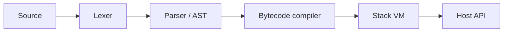

# MoonByte VM

MoonByte is a tiny Lua-like language implemented in C#. It lexes source code, parses an AST, compiles the AST into bytecode, and executes that bytecode on a stack-based virtual machine.

The project is intentionally compact and inspectable: it is built for learning compiler/runtime fundamentals, embedding scripts into host applications, and experimenting with bytecode VM design without pulling in a large parser or runtime framework.

## Features

- Hand-written lexer and recursive-descent parser.
- AST to bytecode compiler.
- Stack-based virtual machine.
- Numbers, strings, booleans, nil, variables and arithmetic.
- User-defined functions with local parameters.
- Table literals with field reads.
- Host API for embedding C# functions.
- CLI with `run`, `disasm`, `bench` and `repl`.
- Self-contained test runner with no external NuGet test packages.
- Mini game-loop embedding demo.

## Quick Start

```bash
dotnet build src/MoonByte.Cli/MoonByte.Cli.csproj -c Release
dotnet run --project tests/MoonByte.Tests/MoonByte.Tests.csproj -c Release
dotnet run --project src/MoonByte.Cli/MoonByte.Cli.csproj -c Release -- run examples/scripts/language_tour.mb
```

Run the embedding demo:

```bash
dotnet run --project examples/EmbeddingDemo/EmbeddingDemo.csproj -c Release
```

Disassemble a script:

```bash
dotnet run --project src/MoonByte.Cli/MoonByte.Cli.csproj -c Release -- disasm examples/scripts/language_tour.mb
```

Benchmark compile plus execute:

```bash
dotnet run --project src/MoonByte.Cli/MoonByte.Cli.csproj -c Release -- bench examples/scripts/language_tour.mb 1000
```

## Language Snapshot

```lua
let answer = 40 + 2;
print("answer=" + answer);

fn add(a, b) {
  return a + b;
}

let player = { name: "pilot", hp: 100 };
print(player.name + " hp=" + player.hp);
print("add=" + add(7, 8));
```

MoonByte borrows Lua's small-script spirit, but keeps the syntax deliberately minimal. The table literal currently uses `:` fields, for example `{ hp: 100 }`.

## CLI

```text
moonbyte run <script.mb>
moonbyte disasm <script.mb>
moonbyte bench <script.mb> [iterations]
moonbyte repl
moonbyte version
```

## Embedding API

```csharp
var engine = new MoonByteEngine(Console.WriteLine);
engine.RegisterHost("spawn", args =>
{
    string name = args[0].AsString();
    double x = args[1].AsNumber();
    double y = args[2].AsNumber();
    Console.WriteLine($"spawn {name} at {x},{y}");
    return MbValue.Nil;
});

engine.Execute("""spawn("orb", 2, 4);""");
```

See [examples/EmbeddingDemo](examples/EmbeddingDemo) for a mini game-loop style host.

## Architecture



More details are in [docs/architecture.md](docs/architecture.md) and [docs/language.md](docs/language.md).

## Repository Layout

```text
src/MoonByte.Core/       lexer, parser, AST, compiler, VM and embedding API
src/MoonByte.Cli/        command line runner, disassembler, REPL and benchmark
tests/MoonByte.Tests/    self-contained test runner
examples/EmbeddingDemo/  C# host integration demo
examples/scripts/        sample MoonByte scripts
docs/                    architecture and language notes
```

## Safety Scope

MoonByte is an educational interpreter. It does not execute native code, load assemblies, access files from scripts, or expose process/network APIs unless the embedding host explicitly registers them.

## License

MIT

