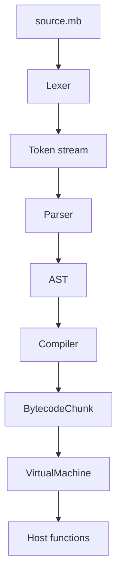

# Architecture

MoonByte follows a classic small language pipeline:

1. `Lexer` turns source text into tokens.
2. `Parser` builds an AST with statements and expressions.
3. `Compiler` emits bytecode instructions and constants.
4. `VirtualMachine` executes bytecode with a value stack and local slots.
5. `MoonByteEngine` exposes a small host API for embedding.

## Runtime Model

The VM has:

- one operand stack per bytecode chunk execution
- global variables stored in a string-keyed dictionary
- local slots for function parameters and `let` declarations inside functions
- host functions registered as `HostFunction` delegates

Function calls create a new local slot array and execute the compiled function chunk recursively. This keeps the implementation small while still making the bytecode boundary explicit.

## Bytecode

Important opcodes:

- `Constant`, `Nil`, `True`, `False`
- `GetGlobal`, `SetGlobal`, `GetLocal`, `SetLocal`
- `Add`, `Subtract`, `Multiply`, `Divide`, comparisons
- `Call`, `Return`
- `MakeTable`, `GetProperty`

Use `moonbyte disasm <script.mb>` to inspect generated bytecode.

